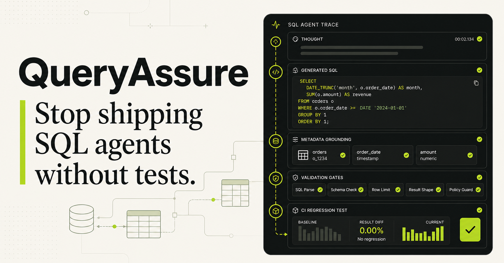

# QueryAssure

**Stop shipping SQL agents without tests.**

Contract testing, metadata grounding, SQL validation, benchmarking, and CI quality gates for reliable SQL Agents.

[](https://github.com/Victoria824/QueryAssure/actions/workflows/ci.yml)
[](LICENSE)

[Try the zero-key playground](https://dataagentkit-playground.vicalayy.chatgpt.site) · [View the repository](https://github.com/Victoria824/QueryAssure) · [Read the data strategy](docs/data-strategy.md)



QueryAssure is an open-source SQL Agent playground plus a contract-testing and CI quality-gate toolkit for agentic analytics. Ask questions in a polished chat interface, inspect the retrieved metadata, generated SQL, validation decisions, and results—then test the same agent for correctness, security, latency, and regressions.

> **v0.3:** QueryAssure brand, reference SQL Agent, HTTP/Python adapters, PostgreSQL and dbt metadata import,
> correctness-first benchmarks, data-quality checks, and a reusable GitHub Action.

## Why this project exists

Text-to-SQL demos are easy. Reliable SQL Agents are not.

A production SQL Agent must survive prompt changes, model upgrades, schema drift, ambiguous metrics, sensitive columns, invalid joins, runaway queries, and unexpected tool traces. QueryAssure treats those behaviours as testable software contracts.

```text
Question → metadata retrieval → SQL generation → policy validation
         → read-only execution → result → trace
                                  ↓
                  QueryAssure contract tests + CI gate
```

## Two independent tools

### SQL Agent playground

- inspectable chat interface
- schema and business-metric retrieval
- deterministic mode requiring no API key
- optional OpenAI provider
- dialect-aware SQL validation
- read-only DuckDB execution
- visible tool trace and quality gates
- FastAPI endpoint for local integrations

### QueryAssure

- YAML test cases that live beside your code
- SQL parsing and read-only enforcement
- table and column grounding checks
- sensitive-data policy checks
- execution-result equivalence
- latency and tool-call budgets
- baseline/candidate regression comparison
- JSON reports suitable for CI

## Quickstart

### One command

```bash
git clone https://github.com/Victoria824/QueryAssure.git
cd QueryAssure
docker compose up --build
```

Open `http://localhost:3000` for the chat experience and `http://localhost:8000/docs`
for the reference Agent API. The web container talks to the API container, so the trace,
SQL validation, and DuckDB execution are real rather than mocked.

The API health endpoint is `http://localhost:8000/api/health`. The full stack is
smoke-tested with Docker Engine in GitHub Actions and is compatible with Docker
Desktop and Colima on macOS.

### Python development

Requires Python 3.10+.

```bash
python -m venv .venv
source .venv/bin/activate
pip install -e '.[dev]'

# Generate deterministic retail data
queryassure seed
queryassure validate-data

# Run the included agent against the golden suite
queryassure test --suite evals/retail.yml

# Start the reference agent API
queryassure serve
```

The API is available at `http://127.0.0.1:8000`, with interactive documentation at `/docs`.

Run the web experience separately:

```bash
npm install
npm run dev
```

Open `http://localhost:3000`.

The [hosted playground](https://dataagentkit-playground.vicalayy.chatgpt.site) is a zero-key interactive walkthrough. For real query execution,
run `queryassure serve`; the same questions, metadata retrieval, SQL gates, and result traces are
available through `POST /api/chat`.

## Put the quality gate in every pull request

QueryAssure is also a composite GitHub Action. It can evaluate the bundled reference
agent or any HTTP endpoint that returns an `AgentTrace`-shaped response.

```yaml
name: SQL Agent quality gate
on: [pull_request]

jobs:
  data-agent-contracts:
    runs-on: ubuntu-latest
    steps:
      - uses: actions/checkout@v4
      - uses: Victoria824/QueryAssure@v0.3.0
        with:
          suite: evals/retail.yml
```

The action writes a human-readable job summary, fails unsafe regressions, and uploads the
complete JSON report as a workflow artifact. Omit `agent-url` to run the included reference
agent and fixture as a zero-configuration smoke test.

## A test case is a contract

```yaml
- id: revenue_by_region
  question: Which region generated the most net revenue in 2026?
  expect:
    required_tables: [analytics_orders]
    forbidden_columns: [customers.email, customers.phone]
    gold_sql: |
      select region, round(sum(net_revenue), 2) as net_revenue
      from analytics_orders
      where ordered_at >= date '2026-01-01'
      group by region
      order by net_revenue desc
  budgets:
    max_latency_ms: 5000
    max_tool_calls: 5
```

QueryAssure compares result sets instead of requiring exact SQL text, because two valid queries can express the same answer.

## Ground agents with PostgreSQL and dbt

DuckDB remains the zero-configuration evaluation runtime. Production metadata can now be
imported from PostgreSQL or dbt without sending schemas to an external service.

```bash
# dbt models, sources, descriptions, tags, lineage, and metrics
queryassure catalog import-dbt \
  --manifest target/manifest.json \
  --output metadata/dbt-catalog.yml

# PostgreSQL tables, columns, comments, and foreign keys
pip install -e '.[postgres]'
export DATABASE_URL='postgresql://...'
queryassure catalog import-postgres \
  --schema public \
  --schema analytics \
  --output metadata/postgres-catalog.yml
```

Credentials are used only for live introspection and are never written to the generated
catalog. Schema-qualified tables are supported by the SQL validator.

## Build a reproducible benchmark

Rank agents from their versioned JSON reports. Correctness and safety are deliberately
ranked ahead of latency.

```bash
queryassure benchmark \
  --report reference=reports/reference.json \
  --report candidate=reports/candidate.json \
  --output benchmarks/leaderboard.json \
  --markdown benchmarks/leaderboard.md
```

The leaderboard reports pass rate, schema hallucinations, policy violations, p50/p95
latency, tool calls, and estimated model cost. See the checked-in
[Northstar benchmark](benchmarks/leaderboard.md) for the current reproducible snapshot.

## Reference dataset: Northstar Retail

The included dataset is deterministic and synthetic. It models an omnichannel Canadian grocery business across:

- customers and behavioural segments
- stores and operating regions
- products, categories, prices, and costs
- orders, line items, promotions, and refunds
- weekly inventory snapshots
- product reviews with realistic missingness
- curated analytics views and business metrics

It intentionally includes seasonality, promotion lift, refund patterns, stock-out scenarios, cancelled orders, sparse fields, PII-classified columns, and tenant boundaries. This provides both clean golden paths and meaningful failure cases without distributing personal or proprietary data.

### Additional data adapters on the roadmap

| Source | Purpose | Distribution approach |
|---|---|---|
| dbt Jaffle Shop | dbt manifest and lineage tests | setup script / attribution |
| DuckDB TPC-H | scalable execution and cost tests | generated locally with `dbgen` |
| Chinook | cross-dialect compatibility | optional download adapter |
| Open Food Facts | messy real-world product metadata | optional adapter; ODbL attribution |
| Spider 2.0 / BIRD | external benchmark compatibility | user-provided benchmark download |

Large third-party datasets are not vendored into this repository. Discover the supported
matrix or generate a local TPC-H database with:

```bash
queryassure dataset list
queryassure dataset install tpch --output data/tpch.duckdb --scale 0.1
```

Northstar Retail is the default because it is deterministic, redistributable, fast enough
for CI, and intentionally contains signals that ordinary random-data generators miss. Run
`queryassure validate-data` to check referential integrity, price/refund bounds, synthetic-only PII,
time/category coverage, a designed stock-out pattern, and a reproducibility fingerprint.

## Architecture

```text
apps/web                         interactive public experience
src/queryassure/agent.py        independently usable SQL Agent
src/queryassure/api.py          FastAPI adapter
src/queryassure/generator.py    deterministic data generator
src/queryassure/metadata.py     DuckDB, PostgreSQL, and dbt metadata adapters
src/queryassure/validators.py   SQL/schema/policy validation
src/queryassure/runner.py       contract runner and report comparison
src/queryassure/benchmark.py    correctness-first public leaderboard
src/queryassure/adapters.py     Python callable and HTTP agent adapters
src/queryassure/datasets.py     dataset catalog and local generators
src/queryassure/data_quality.py synthetic-data contracts and fingerprint
evals/                           golden and chaos suites
metadata/                        schema, relationships, policies, metrics
```

The core package has no LangChain or LangGraph dependency. Agent frameworks connect through adapters rather than becoming mandatory runtime dependencies.

To evaluate an existing HTTP agent that accepts `{ "question": "..." }` and returns an
`AgentTrace`-shaped object:

```bash
queryassure test-http \
  --url http://localhost:8000/api/chat \
  --database data/retail.duckdb \
  --suite evals/retail.yml
```

## Optional live model

Demo mode is intentionally deterministic and free. To exercise a live OpenAI model:

```bash
pip install -e '.[openai]'
export OPENAI_API_KEY=your-key-in-your-shell
queryassure test --live
```

Never commit model keys. `.env` files are ignored.

## Safety model

- database connections are opened read-only
- write operations are rejected before execution
- restricted columns are enforced from versioned metadata
- returned rows are capped
- tests can block releases on policy regressions
- no production data is required for the included demo

This is an engineering toolkit, not a complete authorization system. Production deployments must also enforce permissions in the warehouse itself.

## What ships and what comes next

- **Shipped:** reference agent, playground, synthetic data, policy gates, result equivalence
- **Shipped:** HTTP/Python adapters, Docker Compose, GitHub Action, dbt/PostgreSQL metadata
- **Shipped:** benchmark generator, PR summaries, JSON artifacts, public demo
- **Next:** schema-drift and metadata-injection mutation runner
- **Next:** Snowflake/BigQuery execution adapters and community benchmark submissions

The detailed scope, launch checklist, and first-week success measures are in
[docs/launch-plan.md](docs/launch-plan.md).

## Contributing

Small, focused contributions are welcome—especially database adapters, deterministic policy rules, reproducible failure cases, and documentation fixes. See [CONTRIBUTING.md](CONTRIBUTING.md).

## License

Apache-2.0. Third-party datasets retain their original licenses and are only fetched through optional adapters with attribution.
