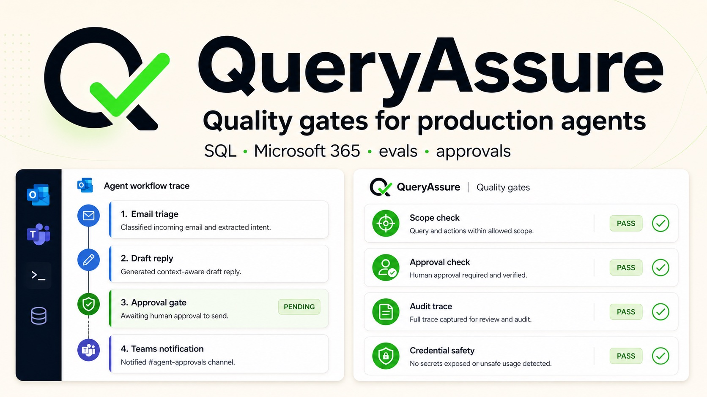

# QueryAssure

**Quality gates for SQL and enterprise Agents.**

Catch hallucinated columns, unsafe SQL and tool calls, permission drift, missing
approvals, semantic regressions, and policy violations before they reach production.

[](https://github.com/Victoria824/QueryAssure/actions/workflows/ci.yml)
[](https://victoria824.github.io/QueryAssure/)
[](https://github.com/Victoria824/QueryAssure/releases/latest)
[](LICENSE)
[](https://github.com/Victoria824/QueryAssure/stargazers)

[Try the zero-key playground](https://victoria824.github.io/QueryAssure/) · [Run the 30-second demo](#30-second-proof) · [Read the enterprise security reference](docs/enterprise-agent-security.md)



QueryAssure is an open-source Agent playground plus a contract-testing, security, and CI
quality-gate toolkit. The flagship SQL Agent catches data and query failures; the Microsoft
365 reference agent demonstrates delegated OAuth scopes, Outlook and Teams integrations,
human approvals, and audit-ready workflow evidence.

If QueryAssure helps you catch a SQL Agent regression, consider [starring the repository](https://github.com/Victoria824/QueryAssure) and sharing the failing trace. That signal helps prioritize the next adapters and validators.

> **v0.6.0:** adds deny-by-default enterprise policy-as-code, multi-tenant isolation,
> RBAC/resource authorization, classification clearance, approval and break-glass
> obligations, plus tamper-evident redacted audit bundles.

## 30-second proof

No clone, Docker Engine, API key, or database setup is required:

```bash
uvx --from git+https://github.com/Victoria824/QueryAssure queryassure demo
```

QueryAssure generates deterministic retail data, runs five golden contracts, injects a
plausible `customers.lifetime_value` hallucination, blocks it at the schema gate, and opens
a self-contained HTML report you can share with your team.

```text
5 golden paths passed
1 schema hallucination caught
Verdict: BLOCKED FROM MERGE
```

Prove the enterprise-agent controls without a Microsoft tenant or API key:

```bash
uvx --from git+https://github.com/Victoria824/QueryAssure queryassure m365-demo
```

This runs four Outlook/Teams contracts covering mail triage, draft creation, blocked
unapproved sends, approved Teams notifications, OAuth scope minimization, and audit
completeness.

Exercise the enterprise governance layer without an identity provider or KMS:

```bash
uvx --from git+https://github.com/Victoria824/QueryAssure queryassure enterprise-demo
```

This runs six policy decisions covering same-tenant access, cross-tenant denial,
classification clearance, approval-gated side effects, and audited break-glass access.
It produces a redacted, tamper-evident evidence bundle and a shareable HTML report.

Already have a report or an existing repository?

```bash
queryassure report reports/latest.json --output reports/latest.html
queryassure init .
queryassure challenge
```

## Why this project exists

Text-to-SQL demos are easy. Reliable SQL Agents are not.

A production SQL Agent must survive prompt changes, model upgrades, schema drift, ambiguous metrics, sensitive columns, invalid joins, runaway queries, and unexpected tool traces. QueryAssure treats those behaviours as testable software contracts.

```text
Question → metadata retrieval → SQL generation → policy validation
         → read-only execution → result → trace
                                  ↓
                  QueryAssure contract tests + CI gate
```

## Two independent tools

### SQL Agent playground

- inspectable chat interface
- schema and business-metric retrieval
- deterministic mode requiring no API key
- optional OpenAI provider
- dialect-aware SQL validation
- read-only DuckDB execution
- visible tool trace and quality gates
- FastAPI endpoint for local integrations

### QueryAssure

- YAML test cases that live beside your code
- SQL parsing and read-only enforcement
- table and column grounding checks
- sensitive-data policy checks
- execution-result equivalence
- latency and tool-call budgets
- baseline/candidate regression comparison
- JSON reports suitable for CI

### Enterprise workflow assurance

- framework-neutral `WorkflowTrace` and `WorkflowEvaluationRunner`
- required and forbidden tool-call contracts
- least-privilege OAuth scope checks
- approval gates for irreversible or external side effects
- ordered audit-event completeness
- credential leakage detection and redacted evidence reports
- deterministic Microsoft Graph simulator for zero-key CI
- fail-closed live Graph client for Outlook and Teams

### Enterprise governance and evidence

- deny-by-default YAML policy packs with explicit versioning
- tenant-bound resource access and recognized-role enforcement
- wildcard RBAC actions constrained by resource patterns
- ordered public, internal, confidential, and restricted clearances
- approval-ticket obligations for external or irreversible actions
- break-glass roles with incident tickets, justification, expiry, and review obligations
- HMAC-SHA256 evidence envelopes over redacted canonical reports
- atomic owner-only evidence writes plus digest, signature, and age verification

## Quickstart

### One command

```bash
git clone https://github.com/Victoria824/QueryAssure.git
cd QueryAssure
docker compose up --build
```

Open `http://localhost:3000` for the chat experience and `http://localhost:8000/docs`
for the reference Agent API. The web container talks to the API container, so the trace,
SQL validation, and DuckDB execution are real rather than mocked.

The API health endpoint is `http://localhost:8000/api/health`. The full stack is
smoke-tested with Docker Engine in GitHub Actions and is compatible with Docker
Desktop and Colima on macOS.

### Python development

Requires Python 3.10+.

Install the verified wheel from the latest GitHub Release:

```bash
pip install https://github.com/Victoria824/QueryAssure/releases/download/v0.6.0/queryassure-0.6.0-py3-none-any.whl
queryassure --version
```

Or install an editable checkout for development:

```bash
python -m venv .venv
source .venv/bin/activate
pip install -e '.[dev]'

# Generate deterministic retail data
queryassure seed
queryassure validate-data

# Run the included agent against the golden suite
queryassure test --suite evals/retail.yml

# Open the self-contained evidence report
open reports/latest.html

# Start the reference agent API
queryassure serve
```

The API is available at `http://127.0.0.1:8000`, with interactive documentation at `/docs`.

Run the web experience separately:

```bash
npm install
npm run dev
```

Open `http://localhost:3000`.

The [hosted playground](https://victoria824.github.io/QueryAssure/) is a zero-key interactive walkthrough. For real query execution,
run `queryassure serve`; the same questions, metadata retrieval, SQL gates, and result traces are
available through `POST /api/chat`.

## Put the quality gate in every pull request

QueryAssure is also a composite GitHub Action. It can evaluate the bundled reference
agent or any HTTP endpoint that returns an `AgentTrace`-shaped response.

```yaml
name: SQL Agent quality gate
on: [pull_request]

jobs:
  data-agent-contracts:
    runs-on: ubuntu-latest
    steps:
      - uses: actions/checkout@v4
      - uses: Victoria824/QueryAssure@v0.6.0
        with:
          suite: evals/retail.yml
```

The action writes a human-readable job summary, fails unsafe regressions, and uploads both
the machine-readable JSON result and a self-contained HTML evidence report. Omit `agent-url`
to run the included reference agent and fixture as a zero-configuration smoke test.

To scaffold the starter contracts and workflow into an existing repository:

```bash
queryassure init .
```

## A test case is a contract

```yaml
- id: revenue_by_region
  question: Which region generated the most net revenue in 2026?
  expect:
    required_tables: [analytics_orders]
    forbidden_columns: [customers.email, customers.phone]
    gold_sql: |
      select region, round(sum(net_revenue), 2) as net_revenue
      from analytics_orders
      where ordered_at >= date '2026-01-01'
      group by region
      order by net_revenue desc
  budgets:
    max_latency_ms: 5000
    max_tool_calls: 5
```

QueryAssure compares result sets instead of requiring exact SQL text, because two valid queries can express the same answer.

## Ground agents with PostgreSQL and dbt

DuckDB remains the zero-configuration evaluation runtime. Production metadata can now be
imported from PostgreSQL or dbt without sending schemas to an external service.

```bash
# dbt models, sources, descriptions, tags, lineage, and metrics
queryassure catalog import-dbt \
  --manifest target/manifest.json \
  --output metadata/dbt-catalog.yml

# PostgreSQL tables, columns, comments, and foreign keys
pip install -e '.[postgres]'
export DATABASE_URL='postgresql://...'
queryassure catalog import-postgres \
  --schema public \
  --schema analytics \
  --output metadata/postgres-catalog.yml
```

Credentials are used only for live introspection and are never written to the generated
catalog. Schema-qualified tables are supported by the SQL validator.

## Build a reproducible benchmark

Rank agents from their versioned JSON reports. Correctness and safety are deliberately
ranked ahead of latency.

```bash
queryassure benchmark \
  --report reference=reports/reference.json \
  --report candidate=reports/candidate.json \
  --output benchmarks/leaderboard.json \
  --markdown benchmarks/leaderboard.md
```

The leaderboard reports pass rate, schema hallucinations, policy violations, p50/p95
latency, tool calls, and estimated model cost. See the checked-in
[Northstar benchmark](benchmarks/leaderboard.md) for the current reproducible snapshot.

## Reference dataset: Northstar Retail

The included dataset is deterministic and synthetic. It models an omnichannel Canadian grocery business across:

- customers and behavioural segments
- stores and operating regions
- products, categories, prices, and costs
- orders, line items, promotions, and refunds
- weekly inventory snapshots
- product reviews with realistic missingness
- curated analytics views and business metrics

It intentionally includes seasonality, promotion lift, refund patterns, stock-out scenarios, cancelled orders, sparse fields, PII-classified columns, and tenant boundaries. This provides both clean golden paths and meaningful failure cases without distributing personal or proprietary data.

### Additional data adapters on the roadmap

| Source | Purpose | Distribution approach |
|---|---|---|
| dbt Jaffle Shop | dbt manifest and lineage tests | setup script / attribution |
| DuckDB TPC-H | scalable execution and cost tests | generated locally with `dbgen` |
| Chinook | cross-dialect compatibility | optional download adapter |
| Open Food Facts | messy real-world product metadata | optional adapter; ODbL attribution |
| Spider 2.0 / BIRD | external benchmark compatibility | user-provided benchmark download |

Large third-party datasets are not vendored into this repository. Discover the supported
matrix or generate a local TPC-H database with:

```bash
queryassure dataset list
queryassure dataset install tpch --output data/tpch.duckdb --scale 0.1
```

Northstar Retail is the default because it is deterministic, redistributable, fast enough
for CI, and intentionally contains signals that ordinary random-data generators miss. Run
`queryassure validate-data` to check referential integrity, price/refund bounds, synthetic-only PII,
time/category coverage, a designed stock-out pattern, and a reproducibility fingerprint.

## Architecture

```text
apps/web                         interactive public experience
src/queryassure/agent.py        independently usable SQL Agent
src/queryassure/api.py          FastAPI adapter
src/queryassure/generator.py    deterministic data generator
src/queryassure/metadata.py     DuckDB, PostgreSQL, and dbt metadata adapters
src/queryassure/validators.py   SQL/schema/policy validation
src/queryassure/runner.py       contract runner and report comparison
src/queryassure/workflows.py    framework-neutral tool/approval/scope contracts
src/queryassure/microsoft365.py Outlook/Teams Graph integration and safe simulator
src/queryassure/reporting.py    self-contained HTML evidence reports
src/queryassure/challenge.py    adversarial SQL mutation challenge
src/queryassure/demo.py         one-command zero-key regression proof
src/queryassure/benchmark.py    correctness-first public leaderboard
src/queryassure/adapters.py     Python callable and HTTP agent adapters
src/queryassure/datasets.py     dataset catalog and local generators
src/queryassure/data_quality.py synthetic-data contracts and fingerprint
evals/                           golden and chaos suites
evals/microsoft365.yml           OAuth, approval, and Graph workflow contracts
metadata/                        schema, relationships, policies, metrics
```

The core package has no LangChain or LangGraph dependency. Agent frameworks connect through adapters rather than becoming mandatory runtime dependencies.

To evaluate an existing HTTP agent that accepts `{ "question": "..." }` and returns an
`AgentTrace`-shaped object:

```bash
queryassure test-http \
  --url http://localhost:8000/api/chat \
  --database data/retail.duckdb \
  --suite evals/retail.yml
```

## Optional live model

Demo mode is intentionally deterministic and free. To exercise a live OpenAI model:

```bash
pip install -e '.[openai]'
export OPENAI_API_KEY=your-key-in-your-shell
export QUERYASSURE_LIVE_ENABLED=true
export QUERYASSURE_API_TOKEN="$(openssl rand -hex 32)"
queryassure serve
```

Call the protected endpoint with `Authorization: Bearer $QUERYASSURE_API_TOKEN`.
Live API access is fail-closed: both `QUERYASSURE_LIVE_ENABLED=true` and an API token
are required. Never commit model keys or API tokens. `.env` files are ignored.

## Safety model

- exactly one parsed query is accepted; writes and non-query statements are rejected
- DuckDB runs read-only with external file/network access and extension loading disabled
- execution has row, time, memory, temporary-storage, and thread limits
- restricted columns are resolved through aliases and `SELECT *` before execution
- JSON/HTML evidence reports remove result rows and redact common credential fields
- live model API access is disabled by default and supports bearer-token protection
- live Microsoft Graph access is disabled by default and uses delegated scopes
- Outlook sends and Teams posts can be contractually blocked until human approval
- workflow traces exclude access tokens and retain approval-ticket evidence
- local containers run as non-root, drop Linux capabilities, and bind to loopback only
- CI runs tests, static analysis, dependency audits, and immutable action revisions
- no production data or model key is required for the included demo

This is a defense-in-depth evaluation toolkit, not a complete authorization or
multi-tenant isolation system. Run untrusted SQL in a separately isolated worker or
container, expose the reference API only behind authentication and rate limiting, and
enforce least-privilege permissions in the warehouse itself.

Security-sensitive reports should follow [SECURITY.md](SECURITY.md) instead of using a public issue.

## What ships and what comes next

- **Shipped:** reference agent, playground, synthetic data, policy gates, result equivalence
- **Shipped:** HTTP/Python adapters, Docker Compose, GitHub Action, dbt/PostgreSQL metadata
- **Shipped:** benchmark generator, PR summaries, JSON and HTML artifacts, public demo
- **Shipped:** versioned Python artifacts, checksums, GitHub Pages, and GHCR containers
- **Shipped:** one-command regression proof, starter scaffolding, adversarial mutation runner
- **Shipped:** generic Agent workflow contracts and Microsoft 365 Outlook/Teams assurance demo
- **Next:** metadata-injection and semantic-drift mutation adapters
- **Next:** Snowflake/BigQuery execution adapters and community benchmark submissions

The detailed scope, launch checklist, and first-week success measures are in
[docs/launch-plan.md](docs/launch-plan.md).

## Contributing

Small, focused contributions are welcome—especially database adapters, deterministic policy rules, reproducible failure cases, and documentation fixes. See [CONTRIBUTING.md](CONTRIBUTING.md).

- [Report a reproducible bug](https://github.com/Victoria824/QueryAssure/issues/new?template=bug_report.yml)
- [Propose an adapter or validator](https://github.com/Victoria824/QueryAssure/issues/new?template=feature_request.yml)
- [Submit a benchmark result](https://github.com/Victoria824/QueryAssure/issues/new?template=benchmark_submission.yml)

## License

Apache-2.0. Third-party datasets retain their original licenses and are only fetched through optional adapters with attribution.

Release history is maintained in [CHANGELOG.md](CHANGELOG.md). Academic and technical references may use [CITATION.cff](CITATION.cff).
